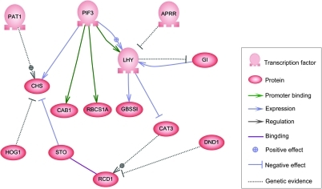

# Gene Regulatory network

I do not have any experience with this, so I went to wikipedia and grabbed the example network from it.



Now let's try to construct it in nadi

```task run image ../output/grn-gene-net.svg
to_file("
PAT1 -> CHS
P1F3 -> CHS
P1F3 -> LHY
P1F3 -> CAB1
P1F3 -> RBCS1A
APRR -> LHY
GI -> LHY
LHY -> GBSS
LHY -> CAT3
STO -> CHS
HOG1 -> CHS
CAT3 -> RCD1
DND1 -> RCD1
", "./output/gene.network")

net.load_file("./output/gene.network")
net.cairo.network("./output/grn-gene-net.svg")
```


The image looks a bit weird because nadi is made for river networks, so let's just place the nodes differently.

```task run image ../output/grn-gene-net2.svg
net.load_file("./output/gene.network")
nodes set_xy(random(), random())
leaves set_xy(1, node.INDEX)
roots set_xy(0, node.INDEX)
net.cairo.draw("./output/grn-gene-net2.svg")
```


Let's just give up and use graphviz

```task run image ../output/grn-gene-net3.svg 
net.load_file("./output/gene.network")
# net save_gv("gene-net.gv", name="n")
# command("dot gene-net.gv -o gene-net-pos.gv")
# commenting out because we need to manually remove the label="\N" there because it is invalid string in nadi
net load_positions("gene-net-pos.gv")
net.cairo.draw("./output/grn-gene-net3.svg")
```


It at least looks like something.

We can see how visualization of graphs other than river is not something that is currently made well in NADI. But as shown here you can use graphviz, or write algorithms to positions the node yourself.


```task run continue
nm inputs.NAME
nm outputs.NAME
```
