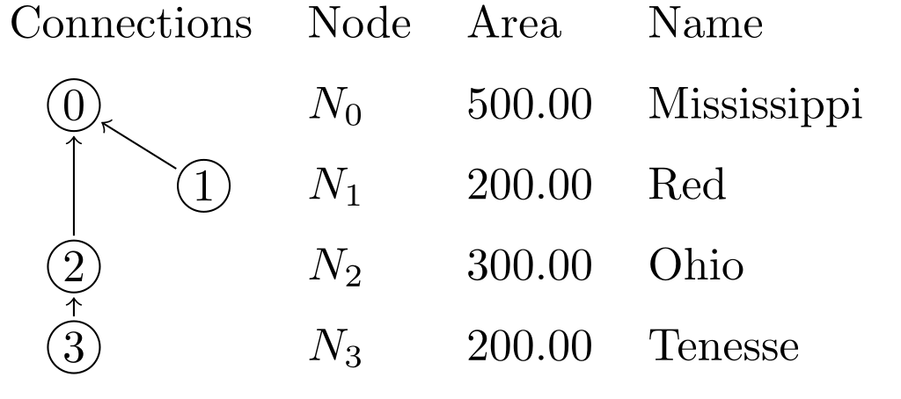

# LaTeX Table

This example runs a task to generate latex table with tikz graphics. Similar method can be used to do generative programming (where you write code to write code for another program).

```task run
network load_str("
tenesse -> ohio
ohio -> mississippi
red -> mississippi
")
node.area = (1 + ORDER) * 100.0

env echo("\\begin{tabular}{llll}")
env echo("Connections & Node & Area & Name \\\\[2mm]")
node(output._?).out = output.INDEX
node echo(render("\\\\Node[{LEVEL}]\\{{INDEX}\\}\\{{INDEX}\\} & $N_{INDEX}$ & {area:f(2)} & {_NAME:case(title)} \\\\\\\\[2mm]"))
env echo("\\end{tabular}
\\tikz[overlay, remember picture]{")
node(output._?).edge = echo(render("\\\\path[->] ({INDEX}) edge ({out});"))
env echo("}")
```

The latex file contains the `Node` command as follows:
```latex

\usepackage{tikz}
\usetikzlibrary{tikzmark}

\newcommand{\Node}[3][0]{%
  \tikz[overlay,remember picture]{\draw (#1 + 0.5, 0.1) circle [radius=0.2] node (#2) {#3};%
  }}
```

The result of the compilation will result in the following table:



This is just an example, you can use this method to generate, markdown, latex, typst, html, and other markups as well. The syntax is a bit hard for LaTeX due to its use of `\` and `{`, both of which are special syntax of template system and need to be escaped. but for others it should be simpler.

This should become easier after the introduction of user defined functions.

The full latex source code is shown below:

```latex
\documentclass{standalone}
\usepackage{tikz}
\usetikzlibrary{tikzmark}

\newcommand{\Node}[3][0]{%
  \tikz[overlay,remember picture]{\draw (#1 + 0.5, 0.1) circle [radius=0.2] node (#2) {#3};%
}}

\begin{document}
\begin{tabular}{llll}

Connections & Node & Area & Name \\[2mm]

\Node[0]{0}{0} & $N_0$ & 500.00 & Mississippi \\[2mm]
\Node[1]{1}{1} & $N_1$ & 200.00 & Red \\[2mm]
\Node[0]{2}{2} & $N_2$ & 300.00 & Ohio \\[2mm]
\Node[0]{3}{3} & $N_3$ & 200.00 & Tenesse \\[2mm]

\end{tabular}
\tikz[overlay, remember picture]{

\path[->] (1) edge (0);
\path[->] (2) edge (0);
\path[->] (3) edge (2);

}
\end{document}
```
