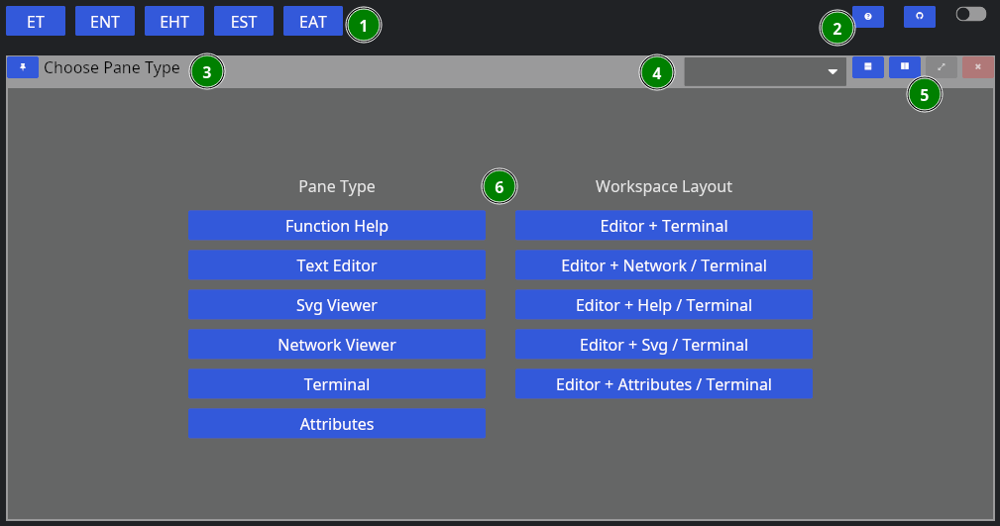
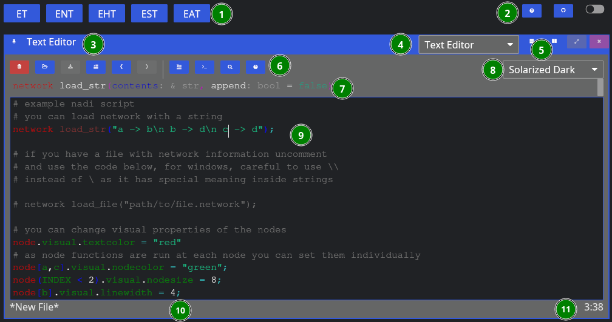
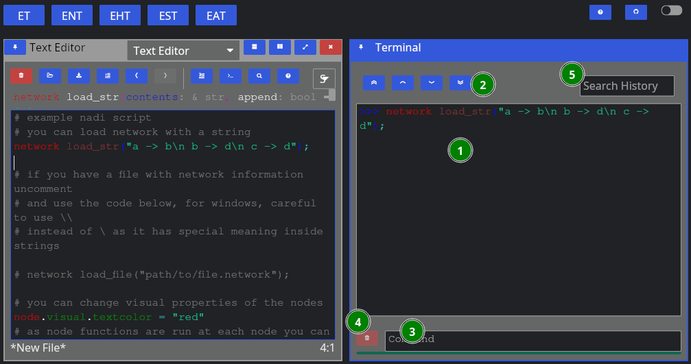
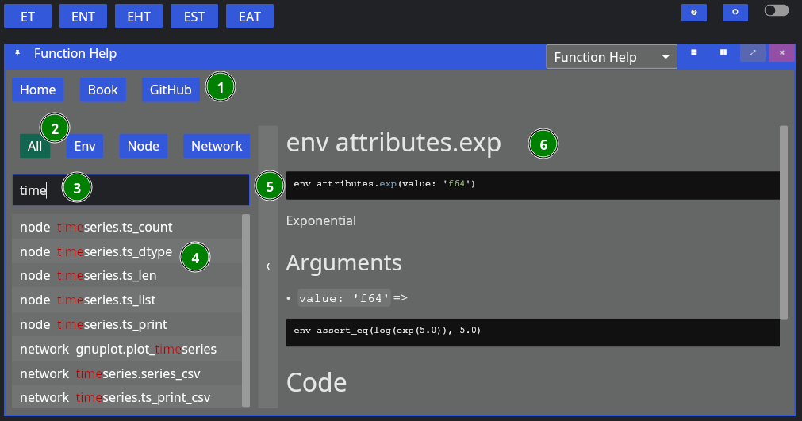

# Getting Started

This section walks you throuh the process of using Nadi system through the CLI and IDE.

Network analysis is done through the Domain Specific Programming Language. This is the main feature of NADI.

You can run the DSL, called tasks through the CLI, or through the IDE. Refer to the [Installation](./installation.md) for how to install them.

Recommended way to develop/write nadi tasks is with IDE, while CLI can be used to automate/batch run it once the tasks are finalized.

## Command Line Interface (CLI)

NADI CLI is available as `nadi` command when you have it installed. You can run it in interactive mode in a Read Eval Print Loop (REPL), or provide a file to run.

So assuming you have the following contents in `sample.tasks` file:

```task
network load_str("a -> b")
node array(LEVEL, ORDER)
```

You run it with:
```bash
nadi sample.tasks
```

You should get the following output:
```task
{
  b = [0, 2],
  a = [0, 1]
}
```

If you run nadi with `--repl` or `-r` flag, then it'll open a REPL. If you have a tasks file provided like before, it'll run the tasks in the file before entering a REPL, otherwise it'll start from empty context.

For more details on other use of `nadi` command. Refer to the output of `nadi --help`. It has options for,
- Evalute some tasks before running the file/repl for setting context,
- Print/Generate help for functions,
- Inspect code for functions,
- Autocomplete nadi functions,
- Generate a template for nadi plugin code, and more.

## Integrated Development Environment (IDE)

NADI IDE contains multiple components to make it easier to write, edit, and run tasks, as well as visualize the network and browse the function documentation.


As you can see, the main UI is divided into multiple panes, which are independent components that you can resize, arrange the way you want.

First, when you start NADI IDE, you come up with this view:



1. Different layout options
2. Global options
3. Pane Title Bar
4. Dropdown to change the Pane Type
5. Pane options (horizontal/vertical split, fullscreen, close)
6. Pane Contents

The layout of each pane are similar, while each one will have their own contents. For example, "Function Help" contains the help for the plugin functions. We will go over each one in a separate chapter.

You can choose a singular pane type here, or chose a combination of panes that feels more useful. Some panes like terminal/attribute views also spawn automatically (if not already in view) when you try to run tasks, or click nodes.

Now, let's choose "Text Editor" for now, then we're greeted with this view:



Now, aside from the global components, we have:

6. Editor Tools,
7. Function Signature: Only shows when cursor is on a function,
8. Editor Theme: Only works for non-NADI formats like Python, C, Rust, R, etc.
9. Tasks File Contents: File contents with syntax highlighting,
10. Current File Path: Where the file is opened from and will be saved, and
11. Line/Column of Cursor.

As for the editor tools: you can hover over them to know their names, and shortcuts. We'll explain them shortly below in the left to right order,

| Button             | Key                        | Function                                                   |
|--------------------|----------------------------|------------------------------------------------------------|
| New File           | `Ctrl` + `n`               | Remove the contents, and the filepath for new file         |
| Open               | `Ctrl` + `o`               | Browse and open a new file                                 |
| Save               | `Ctrl` + `s`               | Save the file, browse for new file if path is not given    |
| Toggle Comment     | `Alt` + `;`                | Comment or uncomment the current selection                 |
| Undo               | `Ctrl` + `z`               | Undo the last edit (edits are saved periodically)          |
| Redo               | `Ctrl` + `y`               | Redo the last undo  (redo vanishes if you edit after undo) |
| Run Line/Selection | `Ctrl` + `Enter`           | Run the current line, or the selection in terminal         |
| Run Buffer         | `Ctrl` + `Shift` + `Enter` | Run the whole buffer (file contents) in terminal           |
| Search             |                            | Search the selection in function help                      |
| Help               |                            | Visit the function help for current function               |

When yo run a line using "Run Line/Selection" it should spawn a terminal pane on the right side



Here we have:
1. Terminal Contents: tasks that were run, and their output,
2. Terminal Navigation: Buttons to goto top/bottom or page up/down,
3. Command Entry: You can directly enter commands here instead of from editor (they won't be saved),
4. Clear: Clear the current command entry,
5. History: Search here for previous commands, clicking them will copy it to the Command Entry

Upto here will be enough to run tasks. But the advantage of the IDE with a Graphical User Interface (GUI) comes in the form of network visualization. If you open the Network Viewer pane, either through the dropdown to change one of the pane. Or split the panes and open Network Viewer there, you can see the network visualized.

The figure below shows the network viewer, and the attribute viewer (it spawns when you click on a node in the network) on the bottom right.


You can click on the "<" button on the right side of the network viewer to expand the sidebar that has details on how to change the visual attributes of the nodes. You can run the examples in the code for testing them out as well.

**Extra components of the IDE** includes the Function Help that you can use to browse the plugin functions' documentation, and SVG viewer that you can use to open SVG files. The SVG viewer is very primitive and only meant to be a quick check/update while you're fine tuning an exported SVG file, use dedicated softwares and web browsers for actual viewing.

The function help looks like below:



The figure contains,
1. Buttons for Reset, and links to Nadi Book and Github,
2. Buttons to filter search by function type,
3. Text Entry to search the function,
4. List of plugin functions,
5. Bar to collapse/expand the function search sidebar, and
6. Plugin function documentation content.

Currently you cannot copy the code or any contents from the documentation, it is a limitation of the GUI library that might be fixed in the future. If you want to copy the text, refer to the web version of the function help (in NADI Book). Or use the `help [type] <function>` task. For example:

```task run
help node render
```

You can copy the example code from the output in the terminal.

That should be enough for you to be able to use the GUI, in the next section we'll talk about the core concepts in NADI system that you need to understand, and then we'll show some examples you can run using what you learned in this chapter.
