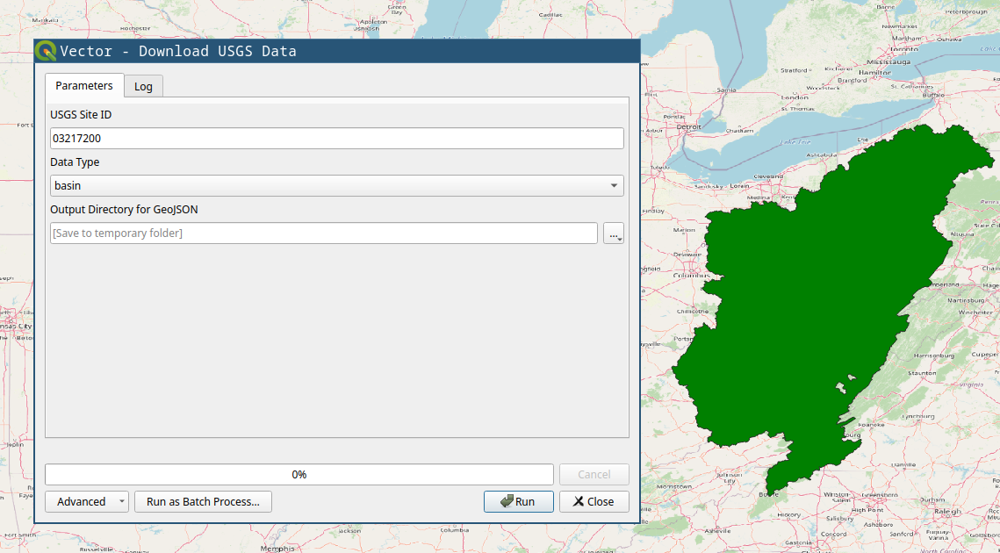
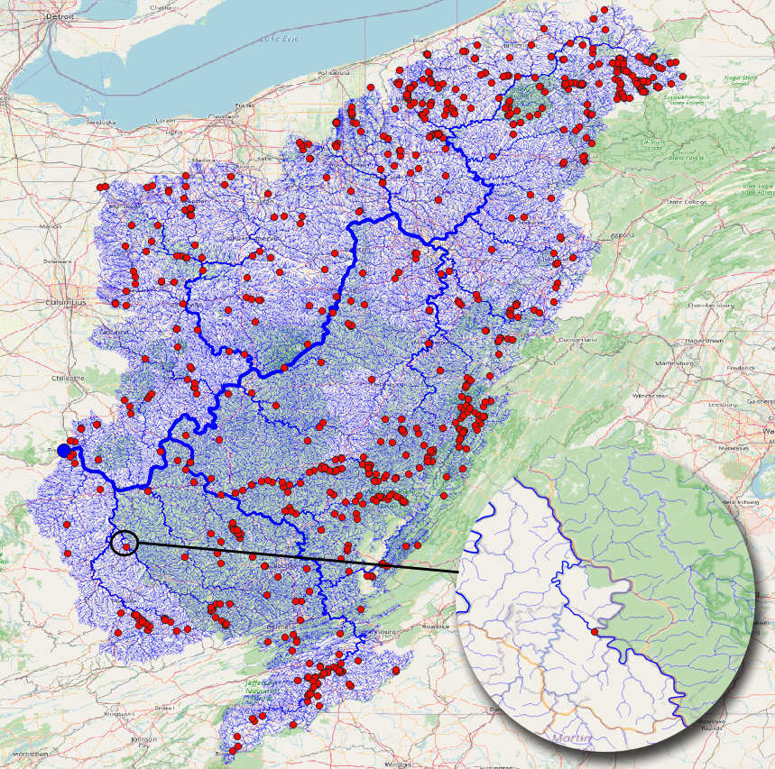
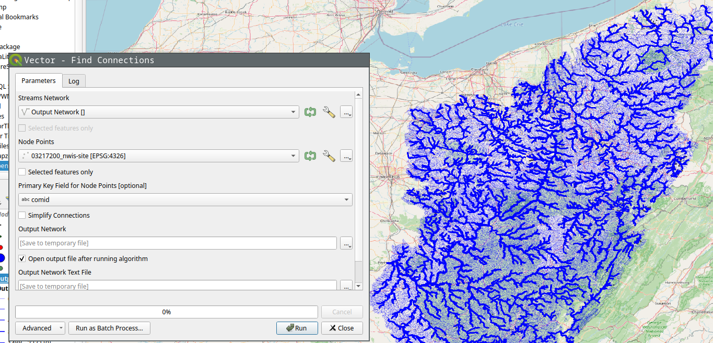
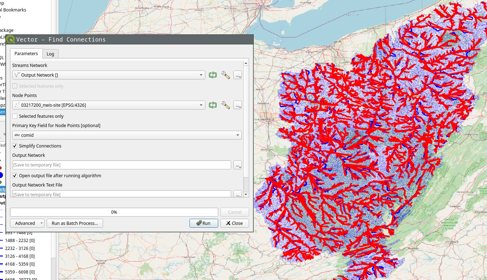
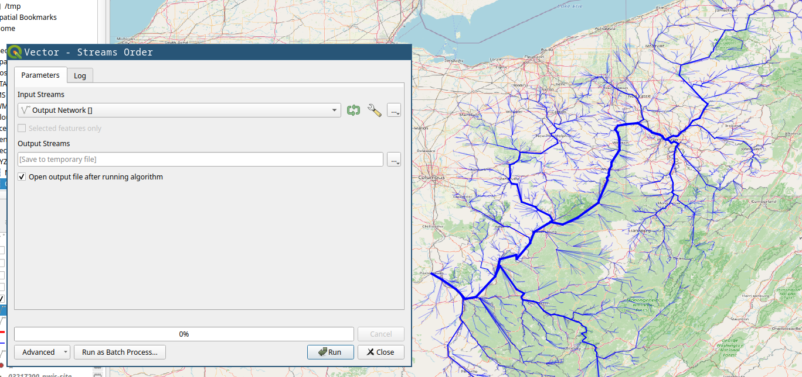

# Example

The examples here will be given using QGIS plugin, and using the CLI tool both. CLI tool is great for quickly running things, and doing things in batch, while QGIS plugin will be better on visualization and manual fixes using other GIS tools.

## Using QGIS Plugin

First **downloading the data** is done through the `Download USGS Data` tool. As shown in the screenshot below, input the USGS site ID and the data type you want to download.



You will need, `tributaries` for the upstream tributaries for network, and `nwis-site` will download the USGS NWIS sites upstream of the location. We will use those two for the example. If you have national data from other sources, you can use the basin polygon to crop them.

**Stream Order** tool is mostly for visual purposes. The figure below shows the results from stream order on right compared to the raw download on left.


After you have streams (tributaries), you can use the **Check Streams** tool to see if there are any errors. It will give all the nodes and their categories, you can filter them to see if it has branches, or if it has more than one outlet. The figure below shows the branches with red dot. If we zoom in we can see how the bifurcation on the stream is detected, and how stream order calculation is confused there.




**Find Connections** tool will find the connection between the points using the stream network. The results below shows the tool being run on the NWIS points.



If we select **simplify** option, it'll only save the start and end point of the connection instead of the whole stream.



Of course you can run **Stream Order** on the results to get a more aesthetically pleasing result.




## Using CLI
An example of running `nadi-gis` using CLI can be done in the following steps:

### Download data
We'll download the streamlines and the NWIS Sites from USGS for station 03217200 (Ohio River at Portsmouth, OH).

```bash
nadi-gis usgs -s 03217200 -d n -d t -o output/
```

This will download two files:

    output/03217200_nwis-site.json  output/03217200_tributaries.json
	
Now we can use `check` command to see if there are any problems with the streams.


```bash
nadi-gis check output/03217200_tributaries.json
```

That gives us the following output:

    Invalid Streams File: Branches (826)
    * Outlet: 1
    * Branch: 826
    * Confluence: 30321
    * Origin: 29591

We can generate a GIS file to locate the branches and see if those are significant. Refer to the `help` for `check` or use the QGIS plugin.

And to find the connections, we use `network` subcommand like this:

```bash
nadi-gis network -i output/03217200_nwis-site.json output/03217200_tributaries.json
```
Output: 

    Outlet: 3221 (-82.996916801, 38.727624498) -> None
    3847 -> 3199
    2656 -> 2644
    399 -> 1212
    2965 -> 3942
    2817 -> 6236
    5708 -> 4733
    2631 -> 5741
    201 -> 2101
    2066 -> 2317
    3770 -> 1045
	... and so on
	
Since this is not as useful, we can use the flags in the `network` subcommand to use a different id, and save the results to a network file.

First we can use `layers` subcommand to see the available fields in the file:

```bash
nadi-gis layers output/03217200_nwis-site.json -a
```

which gives us:

    03217200_nwis-site
      - Fields:
        + "type" (String)
        + "source" (String)
        + "sourceName" (String)
        + "identifier" (String)
        + "name" (String)
        + "uri" (String)
        + "comid" (String)
        + "reachcode" (String)
        + "measure" (String)
        + "navigation" (String)

Using `comid` as the id for points, and saving the results:

```bash
nadi-gis network -i output/03217200_nwis-site.json output/03217200_tributaries.json -p comid -o output/03217200.network
```

The `output/03217200.network` file will have the connections like:

    15410797 -> 15411587
    6889212 -> 6890126
    8980342 -> 10220188
    19440469 -> 19442989
    19390000 -> 19389366
    6929652 -> 6929644
	... and so on

Make sure you use a field with unique name, and valid identifier in NADI System.
