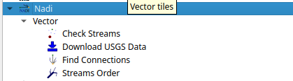

# NADI GIS

NADI GIS is available as a CLI tool and QGIS plugin, the CLI tool has the following functions:

    Usage: nadi-gis [OPTIONS] <COMMAND>
    
    Commands:
      nid      Download the National Inventory of Dams dataset
      usgs     Download data from USGS NHD+
      layers   Show list of layers in a GIS file
      check    Check the stream network to see outlet, branches, etc
      order    Order the streams, adds order attribute to each segment
      network  Find the network information from streams file between points
      help     Print this message or the help of the given subcommand(s)
    
    Options:
      -q, --quiet  Don't print the stderr outputs
      -h, --help   Print help

The important functions are:
- Download NID and USGS NHD+ data,
- Check stream network for validity of DAG (Directed Acyclic Graph) required for NADI,
- Stream ordering for visual purposes,
- Network detection between points of interest using the stream network

You can use the help command for each one of the subcommand for more help.
For example, `usgs` subcommand's help using `nadi-gis help usgs` gets us:

    Download data from USGS NHD+
    
    Usage: nadi-gis usgs [OPTIONS] --site-no <SITE_NO>
    
    Options:
      -s, --site-no <SITE_NO>
              USGS Site number (separate by ',' for multiple)
    
      -d, --data <DATA>
              Type of data (u/d/t/b/n)
              
              [upstream (u), downstream (d), tributaries (t), basin (b), nwis-site (n)]
              
              [default: b]
    
      -u, --url
              Display the url and exit (no download)
    
      -v, --verbose
              Display the progress
    
      -o, --output-dir <OUTPUT_DIR>
              [default: .]
    
      -h, --help
              Print help (see a summary with '-h')

# NADI QGIS
The QGIS plugin for nadi has a subset of the CLI functionality. It can be accessed from the Processing Toolbox.

You can run the tools from there and use the layers in QGIS as inputs. The QGIS plugin will first try to find `nadi-gis` binary on your `PATH` and use it, if not it'll try to use the binary provided with the plugins. It is preferred to have `nadi-gis` available in `PATH` and running without errors.
