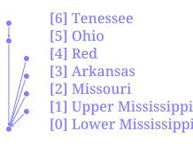

# Node Function
Node function runs on each node. It takes arguments and keyword arguments.

For example following node function takes multiple attribute names and prints them. The signature of the node function is `print_attrs(*args)`.

```task run
!network load_file("./data/mississippi.net")
node print_attrs("INDEX", name=false)
```

Only the `NAME` is printed as they do not have any other attributes.

# Node Function Propagation

Propagation of the node functions refer to the order and selection of nodes to run the function on.

By default node function is run at each node. But that might not be the intended use of the function, for example you might want to:
- run the function only on nodes that satisfy a condition,
- run the funciton only on a group of nodes,

Or you might want to change the order of the node function execution. Like running input nodes before the output node, if your function/analysis needs that.

These things are done with 3 syntax in the node function:

## Order
You can run functions in different orders:
- `sequential`/`seq` => based on node index
- `inverse`/`inv` => inverse based on node index
- `inputsfirst`/`inp` => input nodes before output
- `outputfirst`/`out` => output node before inputs


```task run
network load_str("a -> b\n b ->d \n c -> d \n d -> e")
node<seq> array(INDEX, ORDER)
node<inv> array(INDEX, ORDER)
```

Currently, `inp` and `inv` are equivalent, while `seq` and `out` are also equivalent. But when the parallization is added in the future versions, they will be implemented differently. So for backward compatibility, if you function needs to be run in a certain way, always use that one.

Here an example showing how to calculate the order of the node.
```task run
network load_str("a -> b\n b ->d \n c -> d \n d -> e")
node<inp>.val = sum(inputs.val) + 1;
node array(val, ORDER)
```

If you do not use the `inputsfirst` propagation here, you get an error because the `val` attribute doesn't exist in `inputs`, and if you did have that variable already, it would be old data instead of the recent results from your expression.
```task run
network load_str("a -> b\n b ->d \n c -> d \n d -> e")
node.val = sum(inputs.val) + 1;
node array(val, ORDER)
```

NOTE: I need to work on better error messaging. It is in TODO list for the next major release.


## Node List/Path
You can selectively run only a few nodes based on a list, or a path.

Given this network:

<center>



</center>

### List of Nodes
List of node contains a separated list of node names or quoted string if the name is not valid identifier/number inside `[]`.

```task run
!network load_file("./data/mississippi.net")
node[tenessee,"lower-mississippi"] print_attrs("NAME")
```

### Path of Nodes

Path of node has the same syntax as a path used in the network file. It has starting node and end node. Instead of it representing a single edge like in network file, it represents all the nodes that are between those two (inclusive).

```task run
!network load_file("./data/mississippi.net")
node[tenessee -> "lower-mississippi"] print_attrs("NAME")
```

As we can see in the diagram, the path from tenessee to lower
mississippi includes the ohio node.

## Logical Condition
Logical condition is used by putting an expression that evaluates to a boolean value inside the `()`. 
```task run
!network load_file("./data/mississippi.net")
node("mississippi" in NAME) print_attrs("NAME")
```

## Combination
You can combine the three different types of propagations in a single task using the syntax `node<...>[...](...)`, they must come in that sequence as the order is decided first, then the list/path is taken, and finally the condition is evaluated to boolean before selecting the nodes.

For example:

```task run
!network load_file("./data/mississippi.net")
node[tenessee -> "lower-mississippi"]("mississippi" in NAME) INDEX
node<inv>[tenessee -> "lower-mississippi"] INDEX
node<inv>[tenessee -> "lower-mississippi"](ORDER > 1) INDEX
```
