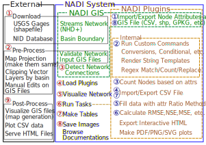
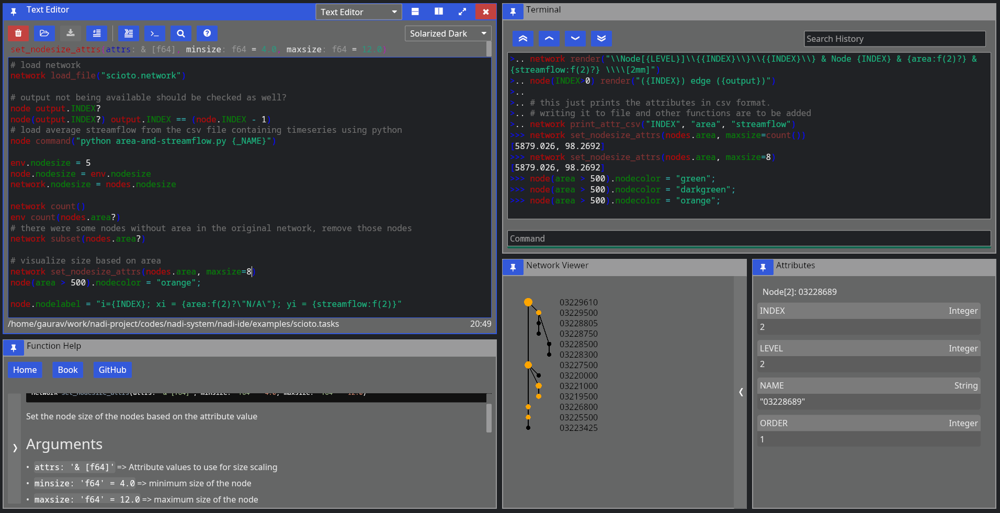

# Network Analysis and Data Integration (NADI)

NADI is group of software packages that facilitate network analysis and do data analysis on data related to network/nodes.


NADI System consists of:

| Tool             | Description                                                 |
|------------------|-------------------------------------------------------------|
| NADI GIS         | Geographic Information (GIS) Tool for Network Detection     |
| NADI Task System | Domain Specific Programming Language                        |
| NADI Plugins     | Plugins that provide the functions in Task System           |
| NADI library     | Rust and Python library to use in your programs             |
| NADI CLI         | Command Line Interface to run NADI Tasks                    |
| NADI IDE         | Integrated Development Environment to write/ run NADI Tasks |

The github repositories consisting of source codes:
| Repo                                                                  | Tool                      |
|-----------------------------------------------------------------------|---------------------------|
| [nadi-gis](https://github.com/Nadi-System/nadi-gis)                   | Nadi GIS                  |
| [nadi-system](https://github.com/Nadi-System/nadi-system)             | Nadi CLI/ IDE/ Core       |
| [nadi-plugins-rust](https://github.com/Nadi-System/nadi-plugins-rust) | Sample Plugins            |
| [nadi-book](https://github.com/Nadi-System/nadi-book)                 | Source for this Nadi Book |

## Workflow
A Typical workflow in NADI System consists of the follwing 4 processes:
1. Download Data
2. Pre-Process Data
3. Network Detection (using NADI GIS)
4. Network Analysis (Using NADI System's DSL, and Plugins)
5. Post Process

The figure below shows the order of how the components of the NADI System (blue) is used along side external tools (black).



Here the numbers in red circles are the order of use for different tools. Here the "Run Tasks" step represents running the Nadi DSL Code in the System, so it is further divided into the tasks inside the code. The numbers on the blue circles show a typical use case of the DSL to perform a research work.

For exact details on what a typical research workflow involving the Nadi DSL is, refer to the examples.

## NADI GIS
Geographic Information (GIS) Tool for Network Detection. The main purpose of the NADI GIS is to find the network connectivity between a set of points using a stream network (which can be developed from elevation models, or downloaded from national databases).

NADI GIS can be used as a terminal command or QGIS plugin, refer to [installation](installation.md#nadi-gis) section for how to install it.

## NADI Task System
Task System is a Domain Specific Programming Language (DSL) that is designed for river network analysis. This is the main core of the network analysis. This is included when you install NADI as a library, CLI or GUI.

## NADI Plugins
The functions available to call in the task system comes from plugins. There are many internal plugins with core functions already available, while users can load their own plugins for other functions.

Refer to the plugins section of the book for more details on how to use plugins, how to write them and what to keep in mind while using them.

## NADI libraries
Rust and Python library to use in your programs. Rust library `nadi_core` is available to download/use from `cargo` with the command `cargo add nadi_core`.

While Python library requires you to clone the repo and build it with `maturin` (for now).
Future plan for it includes publishing it in pypi.

### Rust Libraries
If you are not writing your own rust programs or plugins, you can skip this section.

There are three rust libraries:

| Library                | Use                                                 |
|------------------------|-----------------------------------------------------|
| `nadi_core`            | Core library with data types, and plugin structure  |
| `nadi_plugin`          | Rust Procedural macro library to write nadi plugins |
| `string_template_plus` | Library for string templates with variables         |


Everything is loaded by `nadi_core` so you don't need to load them separately.

### NADI Python

While using NADI from python library, you only have access to nadi data types (Node, Network, etc), and the plugin functions, which are enough for most cases as python language syntax, variables, loops etc will give you a lot of flexibility on how to do your own analysis. The python module is structured as follows:

    nadi [contains Node, Network, etc]
     +-- functions
     | +-- node [contains node functions]
     | +-- network [contains network functions]
     | +-- env [contains env functions]
     +-- plugins
       +-- <plugin> [each plugin will be added here]
       | +-- node [contains node functions]
       | +-- network [contains network functions]
       | +-- env [contains env functions]
	   +-- <next-plugin> and so on ...

The functions are available directly through `functions` submodule, or through each plugin in `plugins` submodule. An example python script looks like this:

```python
import nadi
import nadi.functions as fn

net = nadi.Network("data/ohio.network")
for node in net.nodes:
    try:
        _ = int(node.name)
        node.is_usgs = True
		# this just shows how nadi functions can be called from python
		# for simple functions please use the python native functions
        print(fn.node.render(node, "Node {_NAME} is USGS Site"))
    except ValueError:
        node.is_usgs = False
```

This code shows how to load a network, how to loop through the nodes, and use python logic, or use nadi functions for the node and assign attributes.

More detail on how to use NADI from python will be explained in NADI Python chapter.

## NADI CLI
Command Line Interface to run NADI Tasks.

This can run nadi task files, syntax highlight them for verifying them, generate markdown documentations for the plugins. The documentations included in this book ([Function List](plugins/index.md) and each plugin's page like [Attributes Plugin `attrs`](plugins/attrs.md)) are generated with that. The documentation on each plugin functions comes from their docstrings in the code, please refer to how to write plugins section of the book for details on that.

The available options are shown below.

```
Usage: nadi [OPTIONS] [TASK_FILE]

Arguments:
  [TASK_FILE]  Tasks file to run; if `--stdin` is also provided this runs before stdin

Options:
  -C, --completion <FUNC_TYPE>   list all functions and exit for completions [possible values: node, network, env]
  -c, --fncode <FUNCTION>        print code for a function
  -f, --fnhelp <FUNCTION>        print help for a function
  -g, --generate-doc <DOC_DIR>   Generate markdown doc for all plugins and functions
  -l, --list-functions           list all functions and exit
  -n, --network <NETWORK_FILE>   network file to load before executing tasks
  -p, --print-tasks              print tasks before running
  -P, --new-plugin <NEW_PLUGIN>  Create the files for a new nadi_plugin
  -N, --nadi-core <NADI_CORE>    Path to the nadi_core library for the new nadi_plugin
  -s, --show                     Show the tasks file, do not do anything
  -S, --stdin                    Use stdin for the tasks; reads the whole stdin before execution
  -r, --repl                     Open the REPL (interactive session) before exiting
  -t, --task <TASK_STR>          Run given string as task before running the file
  -h, --help                     Print help
  -V, --version                  Print version
```

## NADI IDE
NADI Integrated Development Environment (IDE) is a Graphical User Interface (GUI) for the users to write/ run NADI Tasks.

As seen in the image below, IDE consists of multiple components arranged in a tiling manner. You can drag them to move them around and build your own layout. When you start IDE it suggests you some layouts and what to open. You can use the buttons on the top right of each pane to:
- change pane type
- vertically split current pane
- horizontally split current pane
- fullscreen current page/ restore layout if it's fullscreen
- close current pane



It has the following components:

### Text Editor
Open text files, edit and save them.

It comes with syntax highlighting for most languages. And custom highlight for tasks and network files.

For Tasks file, it can also show you function signatures on top so you can write tasks easily, knowing what arguments the function needs and what the default values are.

While open inside IDE, it can also run the tasks by sending them to the terminal, or search help documentations on functions. Hover over the buttons on the top row to see which button does what, and the keyboard shortcut to use them as well.

### Terminal
Terminal is there so you can run NADI in a interactive session. Read Eval Print Loop (REPL) of NADI here is meant mostly to be used inside the IDE to evaluate the tasks from editor, but you can open it independently as well.

### Function Help
This is a GUI with the list of all available plugin functions. You can expand the sidebar on left to search and browse functions. You can filter by type of function (node, network, env) with the buttons. When you click a function you can read its documentation on the right side.

Capabilities of the `iced` GUI libraries are limited right now, so you cannot select or copy text from the help. Please refer to the documentation online to do that. Or generate the documentation locally using `nadi-cli` tool.

### Network Viewer
This is a pane where network is visualized, this is a very basic visualization to see the connections and is not optimized for drawing. Please avoid using this pane (making it visible) in case of large networks as it takes a lot of computation to draw this each frame.

### Attribute Browser
When you click on a node on Network Viewer it will open/update showing the attributes of that node. There is no way to edit the attributes from here, which is intensional design as attributes should be assigned from tasks so that they are reproducible. For temporary assignments use the terminal.

### SVG Viewer
This is a basic utility that can open a SVG file from disk and visualize it. You can click the refresh button to re-read the same file. This is intended for a quick way to check the SVG saved/exported from tasks. This is not a full fledge SVG renderer, so open them in image viewers or browsers to see how it looks.


# Trivia
- Nadi means River in Nepali (and probably in many south asian languages).
- First prototype of NADI was Not Available Data Integration, as it
  was meant to be an algorithm to fill data gaps using network
  information, but it was modified to be more generic for many network
  related analysis.
