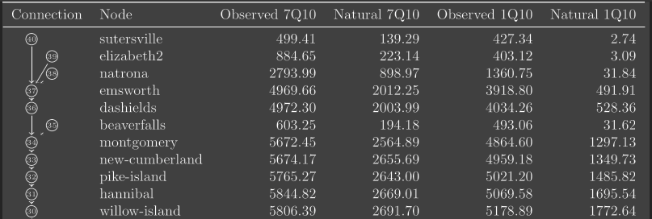

# Motivation

As Hydrologist, we often deal with the data related to the points in
the river. Since most of the analysis requires doing the same things
in multiple points, the initial phase of data cleaning process can be
automated.

We spend a beginning phases of all projects preparing the data for
analysis. And combining the time spent on visualizing the data, it's a
significant chunk of our time.

Data visualization influences the decision making from the
stakeholders. And can save time by making any problems obvious from
the very beginning. For examples, things like showing the quality of
data (continuity for time series), interactive plots to compare data
in different locations/formats, etc can help people understand their
data better.

Besides plot, the example below shows how simply adding a column with
connection visual can immediately make it easier to understand the
relationship between the data points in a river. Without it people
need to be familiar with the names of the data points and their
location, or consult a different image/map to understand the
relationship.

The inspiration on making this software package comes from many years
of struggle with doing the same thing again and again in different
projects like these. And the motivation to make something generic that
can be used for plethora of projects in the future.
