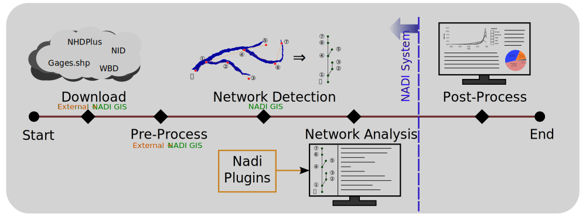

# What is NADI System?

Network Analysis amd Data Integration (NADI) System is a system of programs made to make network based data analysis easier and more accessible.

It consists of multiple tools, that perform two important functions, network detection and network analysis. First part is done throuh the **Geographic Information (GIS) Tool**, while the second part is done using a **Domain Specific Programming Language (DSPL)** called NADI Task system.



# Why use NADI System?
Hydrologic modeling involves the integration of diverse data to
simulate complex (and often poorly understood) hydrological
processes. The analysis of complex hydrological processes often
requires using domain specific calculations, and the visual
representation requires the creation of custom maps and plots. Both of
which can be a repetitive and error-prone processes, diverting time
from data interpretation and scientific inquiry. Efficient methods are
needed to automate these tasks, allowing researchers to focus on
higher-level analysis and translation of their findings.

Current solution to that problem is to either use general purpose programming languages like Python, R, Julia, etc., or use domain specific software packages to increase the reliability of the tasks. Domain Specific Programming Languages (DSPLs) like the NADI Task system provides better syntax for domain specific tasks, while also are general purpose enough for users to extend it for their use cases. NADI System is trying to be the software framework that can connect those two by integrating with various softwares and providing a intuitive way to do network based data analysis.

Some example functionality of NADI system includes:
- Detection of upstream/downstream relationships from stream network,
- Network based programming using an extensible custom programming language,
- Interactive plots and reports generation,
- Import/export from/to various GIS data formats, etc.

## Network Based Data Analysis
If you have data that are network based, like in case of data related to points in a river. NADI provides a text representation of the network that can be manually created with any text editor, or through NADI GIS tool. 

Some domains where the data are network based (directed tree graph) are:
- River networks,
- File/Directory structures,
- Human Resources in a Company,
- Decision Tree / Policy Tree,
- Modeling work with dependencies to component models,


<!-- TODO -->
<!-- ## Interactive outputs -->
<!-- Here is a sample interactive plot made using NADI. -->

<!-- ```task run svg -->

<!-- ``` -->

## Task System
The Domain Specific Programming Language (DSPL) developed for network analysis in NADI makes network analysis simple and intutive. So, it is easier to understand, interpret and catch mistakes. While the NADI IDE has network visualization tools built in that can help you visualiza the network attributes for visual analysis.

For example, implementing "cumulative sum of streamflow" in nadi:

```task
node<inputsfirst>.cum_sf = node.streamflow + sum(inputs.streamflow);
```

The trying to do this in Python while making sure input nodes are run before the output. So you might have to write a recursive algorithm like this:

```python
def cum_sf(node):
	node.cum_sf = node.streamflow + sum([cum_sf(i) for i in node.inputs()])
	return node.cum_sf

cum_sf(network.outlet())
```

While a common mistake people might make is to write a simple loop like this:
```python
for node in network.nodes():
    node.cum_sf = node.streamflow + sum(
	    [i.streamflow for i in node.inputs()]
	)
```
Which doesn't make sure input nodes are run before output in this case, and can error out when some variables are not present. NADI provides special syntax for cases where you can make sure variables exist before running something.

## Extensibility
NADI has two types of plugin systems, which means users can write their own analysis in any programming language and have it interact with NADI through attributes, or they can write it in rust and have even more direct interaction.
